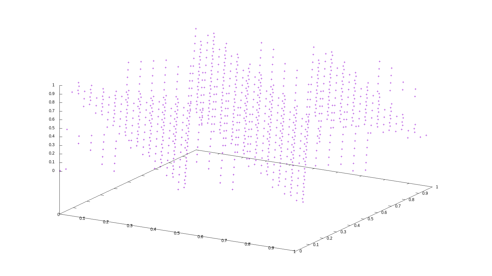
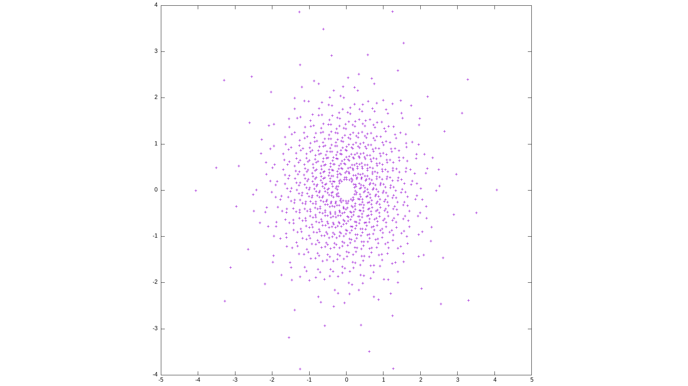

# never trust a random number

test different random number generators:

- linear congruence generator
- fibonacci random number generator
- standard random_number generator

convert random number pairs to gauss pairs (x,y coordinates) via box-muller algorithm; plot 2d correlations.

